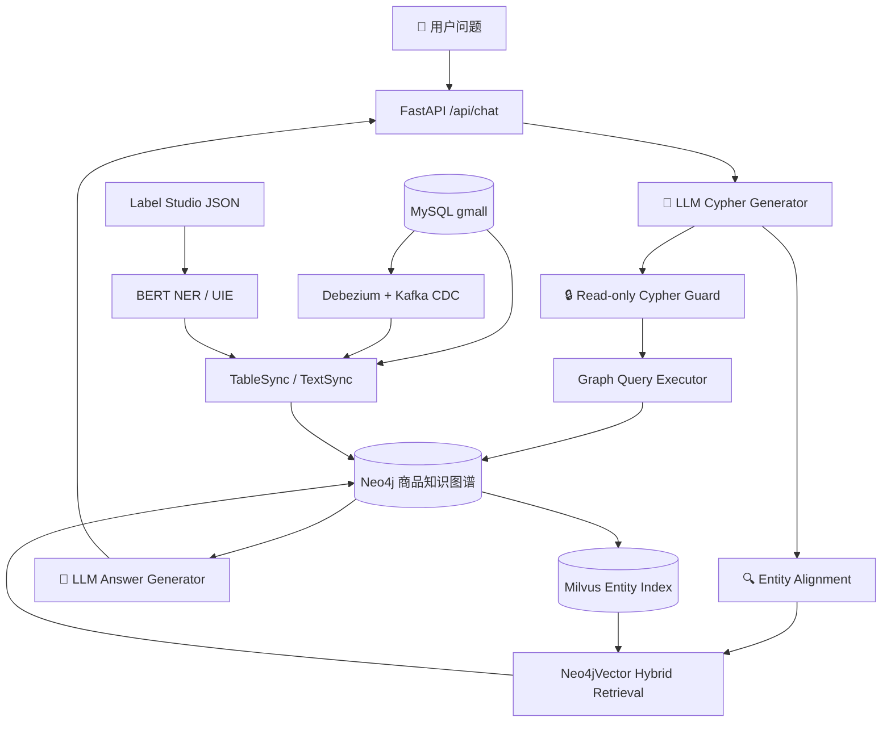

<picture>
  <source media="(prefers-color-scheme: dark)" srcset="">
  
</picture>

<h1 align="center">GraphRAG Commerce</h1>
<p align="center">
  <b>基于 Hybrid Retrieval 与 GraphRAG 的电商知识增强问答系统</b>
</p>

<p align="center">
  <a href="https://github.com/XiaoFeiCode/graph_rag/stargazers"></a>
  <a href="https://github.com/XiaoFeiCode/graph_rag/network/members"></a>
  <a href="https://github.com/XiaoFeiCode/graph_rag/issues"></a>
  <a href="https://github.com/XiaoFeiCode/graph_rag/blob/main/LICENSE"></a>
</p>

<p align="center">
  
  
  
  
  
  
  
  
  
  
  
</p>

---

## 目录

- [项目背景](#项目背景)
- [核心亮点](#核心亮点)
- [系统架构](#系统架构)
- [效果展示](#效果展示)
- [项目结构](#项目结构)
- [快速开始](#快速开始)
- [API 文档](#api-文档)
- [配置说明](#配置说明)
- [高级用法](#高级用法)
  - [数据同步](#数据同步)
  - [CDC 增量同步](#cdc-增量同步)
  - [NER 训练与评估](#ner-训练与评估)
  - [UIE 商品信息抽取](#uie-商品信息抽取)
  - [Milvus 实体索引](#milvus-实体索引)
  - [检索评估](#检索评估)
- [查询安全](#查询安全)
- [开发验证](#开发验证)
- [当前边界与路线图](#当前边界与路线图)
- [贡献指南](#贡献指南)
- [License](#license)

---

## 项目背景

针对电商场景中**商品属性长尾**、**关键词检索召回不足**以及**大模型幻觉**问题，设计基于 Hybrid Retrieval 与 GraphRAG 的知识增强问答系统，通过结构化图谱检索与向量召回融合，提高商品属性问答准确率与知识覆盖能力。

当前项目将商品、品牌、SKU/SPU、品类、属性和标签建模为知识图谱，通过图查询保证结构化关系的准确性，通过向量检索和全文检索提升实体对齐能力，最终由 LLM 基于图谱查询结果生成可追溯的自然语言回答。

---

## 核心亮点

- **商品知识图谱构建与实时同步** — 基于 Neo4j 构建商品知识图谱，完成 SKU/SPU、品牌、品类及商品属性等实体关系建模，并基于 Debezium + Kafka 搭建 MySQL → Neo4j 实时同步链路。

- **Hybrid Retrieval 混合检索框架** — 基于 BGE Embedding + BM25 构建混合检索框架，采用 RRF 融合稀疏召回与向量召回结果，结合 Milvus 向量索引与 BGE-Reranker 精排提升 Top-K 证据相关性。

- **信息抽取与参数化 Cypher 生成** — 基于 Label Studio 构建商品 Query 实体抽取与属性识别标注数据，采用 UIE（ERNIE）进行信息抽取模型微调，实现商品名、品牌、品类、属性名等关键槽位识别；基于识别结果与预定义 Cypher 模板生成参数化查询，实现图路径扩展与子图召回。

- **检索评估与效果提升** — 构建电商长尾商品属性 QA 测试集，采用 Recall@5、MRR、Precision@5 评估检索效果；相比 BM25 单路检索，**Recall@5 提升 17.6%，Precision@5 提升 10.8%**。

---

## 系统架构



> **问答流程**：用户提问 → LLM 生成参数化 Cypher → 实体对齐（Hybrid Retrieval） → 只读安全校验 → 图谱查询 → LLM 基于结构化结果生成可追溯答案。

---

## 效果展示

### Neo4j 商品知识图谱


> Demo 图谱覆盖三级品类、品牌、SPU、SKU、标签及销售属性关系。使用 `scripts/seed_graph.py` 即可一键初始化。

---

## 项目结构

```text
graph_rag/
├── configs/
│   ├── cdc_table_mapping.json       # Debezium 表 → 图谱映射
│   └── uie_product_tag.yaml         # UIE 商品抽取训练配置
├── data/
│   ├── demo/catalog.json            # Demo 商品图谱数据
│   └── ner/                         # NER 标注与预处理数据
├── display_imgs/
│   └── ne4j_dispalay.png            # Neo4j 图谱可视化截图
├── examples/
│   └── questions.json               # Demo 测试问题与预期实体
├── scripts/
│   ├── create_indexes.py            # Neo4j 约束与全文索引创建
│   ├── seed_graph.py                # Demo 图谱一键写入
│   ├── smoke_query.py               # 图谱查询 smoke test
│   ├── sync_milvus_entities.py      # Neo4j 实体 → Milvus 同步
│   ├── register_debezium_connector.py
│   └── neo4j_client.py              # Neo4j driver 上下文管理器
├── src/
│   ├── configuration/config.py      # 全局配置（路径/模型/数据库）
│   ├── datasync/                    # MySQL → Neo4j 数据同步
│   │   ├── table_sync.py            #   批量全量同步
│   │   ├── cdc_consumer.py          #   CDC 增量消费
│   │   ├── text_sync.py             #   NER 标签抽取 → Tag 节点
│   │   └── utils.py                 #   MySQLReader / Neo4jWriter
│   ├── evaluation/                  # 检索评估
│   │   └── retrieval_eval.py        #   Recall / Precision / MRR 报告
│   ├── ner/                         # NER 数据处理、训练、评估、预测
│   │   ├── preprocess.py
│   │   ├── train.py
│   │   ├── eval.py
│   │   ├── predict.py
│   │   └── uie_train.py
│   ├── retrieval/                   # Milvus 实体索引与检索
│   │   └── milvus_entity_store.py
│   └── web/                         # FastAPI 服务与前端
│       ├── app.py                   #   应用入口
│       ├── service.py               #   GraphRAG 问答服务
│       ├── cypher_guard.py          #   Cypher 只读安全校验
│       ├── schemas.py               #   Pydantic 请求/响应模型
│       ├── utils.py                 #   索引管理工具
│       └── static/index.html        #   聊天前端页面
├── tests/
│   ├── test_cypher_guard.py
│   ├── test_cdc_consumer.py
│   └── test_retrieval_eval.py
├── docker-compose.yml               # Neo4j
├── docker-compose.cdc.yml           # MySQL + Kafka + Debezium
├── docker-compose.milvus.yml        # Milvus standalone
├── pyproject.toml
├── uv.lock
└── README.md
```

---

## 快速开始

### 环境要求

| 组件 | 说明 |
| --- | --- |
| Python | 3.12+ |
| uv | Python 包管理器 |
| Docker + Compose | 运行 Neo4j / Milvus / CDC 基础设施 |

> **Windows 用户**：以下命令使用 PowerShell 语法，Linux/macOS 用户将 `Copy-Item` 替换为 `cp`。

### 1. 克隆项目

```bash
git clone https://github.com/XiaoFeiCode/graph_rag.git
cd graph_rag
```

### 2. 安装依赖

```powershell
uv sync --locked
```

### 3. 配置环境变量

```powershell
Copy-Item .env.example .env
```

编辑 `.env`，至少确保以下配置正确：

```text
NEO4J_URI=neo4j://localhost
NEO4J_USER=neo4j
NEO4J_PASSWORD=graph_rag_demo
```

### 4. 启动 Neo4j

```powershell
docker compose up -d
```

> Neo4j Browser 访问 http://localhost:7474（默认 neo4j / graph_rag_demo）

### 5. 初始化 Demo 图谱

```powershell
uv run python -m scripts.seed_graph
```

### 6. 验证

```powershell
uv run python -m scripts.smoke_query
```

输出示例：

```text
Node counts — Category1: 3, Category2: 6, Category3: 12, Trademark: 12, SPU: 12, SKU: 36
Sample product: iPhone 15 (Apple)
Sample product: HUAWEI Mate 60 (华为)
Sample product: 美的 5L 空气炸锅 (美的)
```

### 7. 启动问答服务

安装 RAG 依赖并在 `.env` 中配置 DeepSeek API：

```powershell
uv sync --extra rag
```

编辑 `.env`，添加：

```text
DEEPSEEK_API_KEY=你的API_KEY
DEEPSEEK_BASE_URL=https://api.deepseek.com
```

启动服务：

```powershell
uv run uvicorn src.web.app:app --host 0.0.0.0 --port 8000
```

打开浏览器访问 **http://localhost:8000** 即可使用聊天界面。

---

## API 文档

### `POST /api/chat`

电商商品问答接口。

**Request**

```json
{
  "message": "有没有适合拍照的 Apple 手机？"
}
```

| 字段 | 类型 | 必填 | 说明 |
| --- | --- | --- | --- |
| `message` | `string` | 是 | 用户自然语言问题 |

**Response**

```json
{
  "message": "根据商品知识图谱，iPhone 15 属于 Apple 品牌，卖点包括 4800 万像素主摄、A16 芯片和轻薄机身。"
}
```

| 字段 | 类型 | 说明 |
| --- | --- | --- | --- |
| `message` | `string` | 基于图谱查询结果生成的回答 |

**状态码**

| 状态码 | 说明 |
| --- | --- |
| `200` | 成功返回 |
| `4xx/5xx` | 返回错误信息文本 |

**内部流程**

1. LLM 解析用户问题，生成参数化 Cypher 查询语句
2. 提取需要对齐的实体（品牌/品类/SPU/SKU）进行 Hybrid Retrieval
3. 只读安全校验（禁止写入/多语句/未声明参数）
4. 执行图谱查询
5. LLM 基于查询结果生成自然语言回答

**示例问题**（`examples/questions.json`）

| 问题 | 预期实体 |
| --- | --- |
| 有没有适合拍照的 Apple 手机？ | Apple |
| 华为 Mate 系列有什么卖点？ | 华为, Mate |
| 推荐一个适合少油烹饪的厨房电器 | — |
| iPhone 15 有哪些 SKU？ | iPhone 15 |

---

## 配置说明

| 变量 | 用途 | 默认值 |
| --- | --- | --- |
| `DEEPSEEK_API_KEY` | DeepSeek API Key | (必填) |
| `DEEPSEEK_BASE_URL` | API 地址 | `https://api.deepseek.com` |
| `NEO4J_URI` | Neo4j Bolt 连接 | `neo4j://localhost` |
| `NEO4J_USER` | Neo4j 用户名 | `neo4j` |
| `NEO4J_PASSWORD` | Neo4j 密码 | `graph_rag_demo` |
| `MYSQL_HOST` | MySQL 地址 | `localhost` |
| `MYSQL_PORT` | MySQL 端口 | `3306` |
| `MYSQL_USER` | MySQL 用户名 | `root` |
| `MYSQL_PASSWORD` | MySQL 密码 | — |
| `MYSQL_DB` | 数据库名称 | `gmall` |
| `MODEL_NAME` | NER 预训练模型 | `google-bert/bert-base-chinese` |
| `CDC_KAFKA_BOOTSTRAP_SERVERS` | Kafka 地址 | `localhost:9092` |
| `MILVUS_URI` | Milvus 地址 | `http://localhost:19530` |
| `MILVUS_COLLECTION` | Milvus Collection | `commerce_entities` |
| `UIE_MODEL_ID` | ModelScope UIE 模型 | `iic/nlp_structbert_siamese-uie_chinese-base` |

> ⚠️ **请勿提交真实的 `.env` 文件到 Git。**

---

## 高级用法

### 数据同步

从 MySQL 全量同步商品、品牌、品类和属性到 Neo4j：

```powershell
uv run python -m src.datasync.table_sync
```

使用 NER 模型从商品描述抽取标签写入 `Tag` 节点：

```powershell
uv sync --extra ml
uv run python -m src.datasync.text_sync
```

### CDC 增量同步

```powershell
docker compose -f docker-compose.cdc.yml up -d    # 启动基础设施
uv sync --extra cdc
uv run python -m scripts.register_debezium_connector   # 注册 connector
uv run python -m src.datasync.cdc_consumer              # 启动消费
```

> 表 → 图谱映射维护在 `configs/cdc_table_mapping.json`。

### NER 训练与评估

```powershell
uv sync --extra ml
uv run python -m src.ner.preprocess    # 预处理标注数据
uv run python -m src.ner.train         # 训练
uv run python -m src.ner.eval          # 评估
uv run python -m src.ner.predict       # 命令行预测
```

| 配置项 | 值 |
| --- | --- |
| Backbone | `google-bert/bert-base-chinese` |
| 任务 | 商品文本 BIO 序列标注 |
| Epochs | 5 |
| Batch Size | 2 |
| Learning Rate | 7e-6 |
| Mixed Precision | fp16 |

### UIE 商品信息抽取

```powershell
uv sync --extra uie
uv run python -m scripts.download_uie_model   # 下载 UIE 模型
uv run python -m src.ner.uie_train --dry-run   # 校验配置
```

### Milvus 实体索引

```powershell
docker compose -f docker-compose.milvus.yml up -d
uv sync --extra milvus
uv run python -m scripts.sync_milvus_entities
```

### 检索评估

```powershell
uv run python -m src.evaluation.retrieval_eval --top-k 5
```

报告输出至 `reports/retrieval_eval.json` 和 `reports/retrieval_eval.md`。

---

## 查询安全

LLM 生成的 Cypher 在执行前经过多层校验（`src/web/cypher_guard.py`）：

- ✅ 只允许**单条**查询语句
- ✅ 必须以 `MATCH`、`OPTIONAL MATCH`、`WITH`、`UNWIND` 等读子句开头
- ✅ 必须包含 `RETURN`
- ✅ 禁写 — `CREATE`、`MERGE`、`SET`、`DELETE`、`REMOVE`、`DROP`、`LOAD`、`CALL`
- ✅ 引用的 `$param_0`、`$param_1` 等必须由实体对齐阶段声明

```python
# 示例：合法
"MATCH (n:SPU {name: $param_0}) RETURN n.name AS name"

# 示例：被拦截
"MATCH (n) DELETE n RETURN n"
"MATCH (n) RETURN n; MATCH (m) RETURN m"
```

---

## 开发验证

```bash
# 单元测试
python -m unittest tests.test_cypher_guard

# 编译检查
python -m compileall -q src scripts tests main.py

# Docker Compose 配置检查
docker compose config
docker compose -f docker-compose.cdc.yml config
docker compose -f docker-compose.milvus.yml config

# 端到端 smoke test
uv run python -m scripts.seed_graph
uv run python -m scripts.smoke_query
uv run python -m src.evaluation.retrieval_eval --top-k 5
```

---

## 当前边界与路线图

### 当前边界

- Demo 图谱为小样例数据，用于验证图谱建模、索引和查询链路。
- 完整问答依赖 DeepSeek API、BGE Embedding 和 Neo4j 向量索引。
- `checkpoints/` 下模型权重不提交 Git。
- MySQL → Neo4j 支持批量同步和 CDC 消费，业务表覆盖可继续扩展。
- UIE 和 Milvus 为可选扩展能力。

### 路线图

- [ ] 扩展 Retrieval Evaluation：Full-text vs Vector vs Hybrid 三路对比
- [ ] 将 Milvus + Reranker 检索结果接入 GraphRAG 实体对齐主链路
- [ ] 增加 Cypher 生成模板与错误重试策略
- [ ] 扩展 CDC 表映射覆盖价格、库存和销售属性变更
- [ ] 增加 GraphRAG API 集成测试与 CI

---

## 贡献指南

欢迎 Issue 和 PR。

1. **Fork** 本仓库
2. 创建特性分支：`git checkout -b feature/amazing-feature`
3. 提交变更：`git commit -m 'feat: add amazing feature'`
4. 推送分支：`git push origin feature/amazing-feature`
5. 提交 **Pull Request**

提交前请确保：

```bash
python -m unittest discover tests
python -m compileall -q src scripts tests main.py
```

---

## License

本项目基于 [MIT License](LICENSE) 开源。

---

<p align="center">
  <sub>Built with ❤️ by <a href="https://github.com/XiaoFeiCode">XiaoFeiCode</a></sub>
</p>
