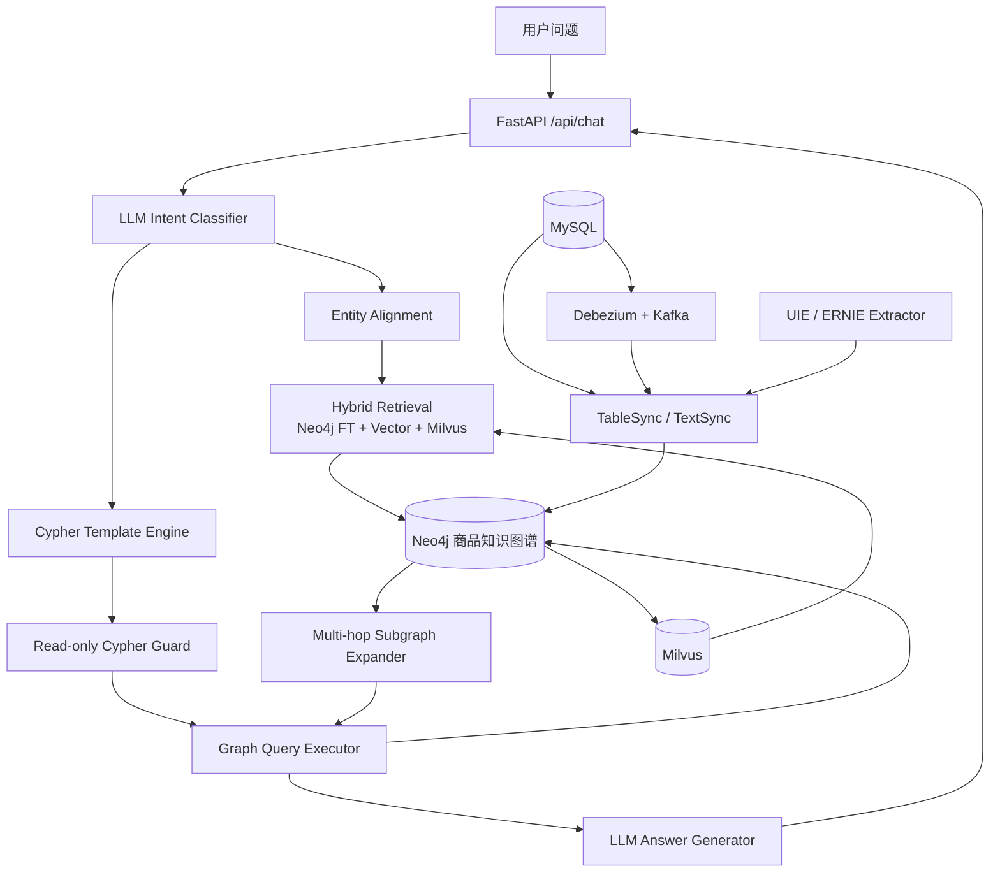

# GraphRAG Commerce · 电商知识增强问答系统

<p align="center">
  <b>基于 Neo4j + Hybrid Retrieval + GraphRAG 的电商商品知识增强问答系统</b>
</p>

<p align="center">
  
  
  
  
  
  
  
</p>

---

## 项目概述

针对电商场景中**商品属性长尾**、**关键词检索召回不足**以及**大模型幻觉**问题，设计并实现基于 Hybrid Retrieval 与 GraphRAG 的知识增强问答系统。通过结构化图谱检索与向量召回融合，提高商品属性问答准确率与知识覆盖能力。

- 基于 Neo4j 构建商品知识图谱，完成 SKU/SPU、品牌、品类及商品属性等实体关系建模，并基于 Debezium + Kafka 搭建 MySQL → Neo4j 实时同步链路。
- 基于 BGE Embedding + BM25 构建 Hybrid Retrieval 混合检索框架，采用 RRF 融合稀疏召回与向量召回结果，结合 Milvus 向量索引与 BGE-Reranker 精排提升 Top-K 证据相关性。
- 基于 Label Studio 构建商品实体抽取标注数据，采用 ERNIE 3.0 进行信息抽取模型微调，实现商品名、品牌、品类、属性名等关键槽位识别；基于识别结果与预定义 Cypher 模板生成参数化查询，实现图路径扩展与子图召回。

## 核心能力

- **商品知识图谱** — SKU、SPU、品牌、三级品类、平台属性、销售属性及商品标签全覆盖。
- **CDC 实时同步** — Debezium + Kafka 消费 MySQL binlog 变更，增量写入 Neo4j。
- **Hybrid Retrieval** — BGE 向量 + Neo4j full-text + Milvus 三路召回 → RRF 融合 → BGE-Reranker 精排。
- **UIE 信息抽取** — 基于 Label Studio 标注数据，ERNIE 3.0 微调，提取商品名、品牌、品类、属性、卖点、规格。
- **GraphRAG 问答** — Cypher 模板化参数查询 + 子图多跳扩展 + LLM 生成可追溯回答。
- **查询安全** — 执行前校验：禁写、单语句、参数声明、只读子句。

## 系统架构



## 运行效果


## 知识图谱可视化


## 技术栈

| 类别 | 组件 |
| --- | --- |
| 图数据库 | Neo4j 5.x |
| 向量数据库 | Milvus 2.4+ |
| 大模型 | DeepSeek (via LangChain) |
| Embedding | BAAI/bge-large-zh-v1.5 |
| Reranker | BAAI/bge-reranker-v2-m3 |
| UIE 模型 | nghuyong/ernie-3.0-base-zh |
| Web 框架 | FastAPI |
| 消息队列 | Kafka + Debezium Connect |
| 依赖管理 | uv / pip |

## 项目结构

```text
graph_rag/
├── data/
│   ├── ner/                       # NER 训练与标注数据
│   │   ├── description.txt
│   │   └── raw/data.json          #   Label Studio BIO 标注
│   ├── uie/                       # UIE 预处理数据
│   └── gmall.sql                  # MySQL 业务库数据
├── docs/
│   ├── docker_milvus.png
│   ├── ne4j_dispalay.png
│   └── question_display.png
├── scripts/
│   ├── create_indexes.py          # Neo4j 约束与全文索引
│   ├── sync_milvus_entities.py    # Neo4j → Milvus 同步
│   ├── register_debezium_connector.py
│   └── neo4j_client.py
├── src/
│   ├── configuration/             # 全局配置与映射文件
│   ├── datasync/                  # MySQL → Neo4j 同步
│   ├── evaluation/                # 检索评估
│   ├── ner/                       # NER & UIE 信息抽取
│   │   ├── train.py / eval.py / predict.py
│   │   ├── uie_preprocess.py      #   UIE 数据转换
│   │   ├── uie_train.py           #   ERNIE 3.0 微调
│   │   └── uie_predict.py         #   UIE 推理
│   ├── retrieval/                 # Hybrid Retrieval
│   │   ├── hybrid_retriever.py    #   RRF 融合 + Reranker
│   │   ├── search_factory.py      #   多路召回工厂
│   │   ├── subgraph_expander.py   #   多跳子图扩展
│   │   └── milvus_entity_store.py
│   └── web/                       # FastAPI 服务
│       ├── app.py / service.py
│       ├── cypher_guard.py        #   只读安全校验
│       ├── cypher_templates.py    #   Cypher 模板
│       └── static/index.html
├── tests/
├── docker-compose.yml             # Neo4j
├── docker-compose.cdc.yml         # MySQL + Kafka + Debezium
├── docker-compose.milvus.yml      # Milvus
├── requirements-uie.txt
├── pyproject.toml
└── LICENSE
```

## 环境要求

| 组件 | 说明 |
| --- | --- |
| Python | 3.12+ |
| Docker + Compose | 运行 Neo4j / Milvus / CDC 基础设施 |
| MySQL | 5.7+（数据同步时需要） |
| DeepSeek API Key | 启动问答服务时需要 |

## 快速开始

### 1. 安装依赖

```bash
git clone https://github.com/XiaoFeiCode/graph_rag.git
cd graph_rag
uv sync --locked
```

### 2. 配置环境变量

```bash
cp .env.example .env
```

编辑 `.env`，配置 Neo4j 和 DeepSeek：

```text
NEO4J_URI=neo4j://localhost
NEO4J_USER=neo4j
NEO4J_PASSWORD=你的密码
DEEPSEEK_API_KEY=你的API_KEY
DEEPSEEK_BASE_URL=https://api.deepseek.com
```

### 3. 启动 Neo4j

```bash
docker compose up -d
```

### 4. 导入数据

```bash
# MySQL 导入业务数据
mysql -u root -p gmall < data/gmall.sql

# 全量同步到 Neo4j
uv run python -m src.datasync.table_sync
```

### 5. 创建索引

```bash
uv run python -m scripts.create_indexes
```

### 6. 启动 Milvus（可选）

```bash
docker compose -f docker-compose.milvus.yml up -d
uv sync --extra milvus
uv run python -m scripts.sync_milvus_entities
```


### 7. 启动问答服务

```bash
uv sync --extra rag
uv run uvicorn src.web.app:app --host 0.0.0.0 --port 8000
```

打开浏览器访问 **http://localhost:8000**。

## API 接口

### `POST /api/chat`

```json
// Request
{ "message": "有没有适合拍照的 Apple 手机？" }

// Response
{ "message": "根据商品知识图谱，iPhone 15 属于 Apple 品牌..." }
```

**内部流程：** LLM 意图分类 → 实体对齐 (Hybrid Retrieval + RRF + Reranker) → Cypher 模板匹配 → 只读安全校验 → 图谱查询 / 子图扩展 → LLM 生成回答。

## 数据同步

### 全量同步

```bash
uv run python -m src.datasync.table_sync
```

### CDC 增量同步

```bash
docker compose -f docker-compose.cdc.yml up -d
uv sync --extra cdc
uv run python -m scripts.register_debezium_connector
uv run python -m src.datasync.cdc_consumer
```

表映射：`src/configuration/cdc_table_mapping.json`

## UIE 信息抽取

```bash
# AutoDL / GPU 环境
pip install -r requirements-uie.txt
python -m src.ner.uie_train
```

训练数据：`data/uie/`（`uie_preprocess.py` 从 Label Studio 标注转换）

## 检索评估

```bash
uv run python -m src.evaluation.retrieval_eval --top-k 5
```

5 路对比：BM25 Fulltext / Neo4j Vector / Hybrid RRF / RRF+Reranker / Milvus Vector

## 配置说明

| 变量 | 用途 | 默认值 |
| --- | --- | --- |
| `DEEPSEEK_API_KEY` | DeepSeek API Key | （必填） |
| `NEO4J_URI` | Neo4j Bolt 连接 | `neo4j://localhost` |
| `NEO4J_USER` / `NEO4J_PASSWORD` | Neo4j 账号密码 | — |
| `EMBEDDING_MODEL_NAME` | BGE 模型 | `BAAI/bge-large-zh-v1.5` |
| `LLM_MODEL_NAME` | LLM 模型 | `deepseek-chat` |
| `MYSQL_HOST` / `MYSQL_DB` | MySQL 连接 | `localhost` / `gmall` |

完整配置见 `.env.example`。

## License

MIT License · [XiaoFeiCode](https://github.com/XiaoFeiCode)
