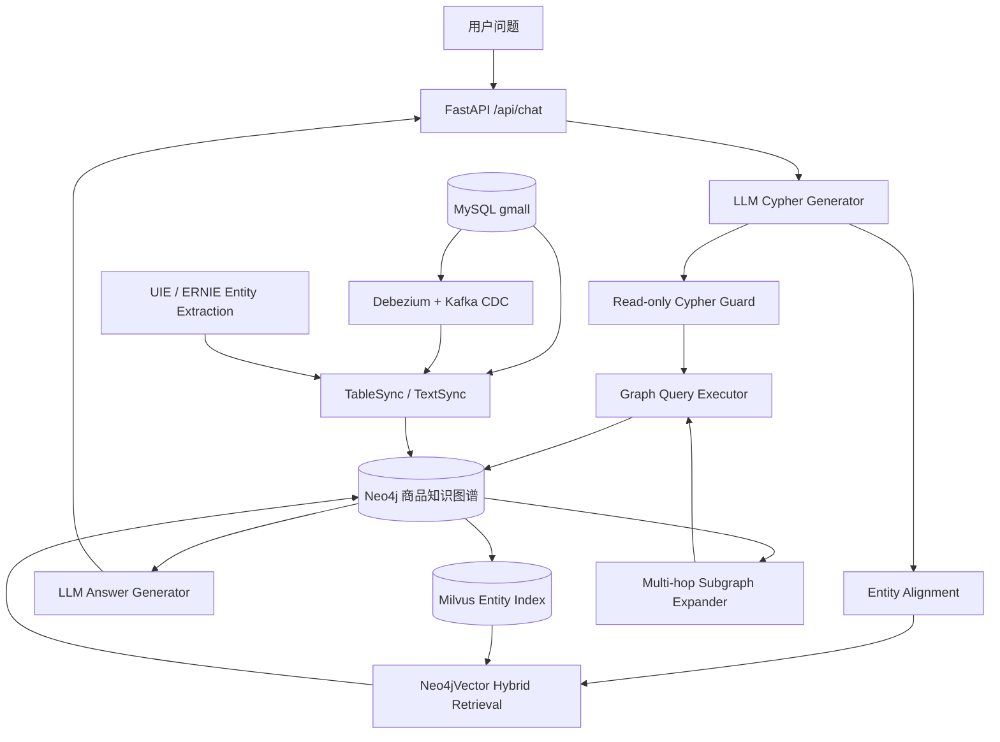
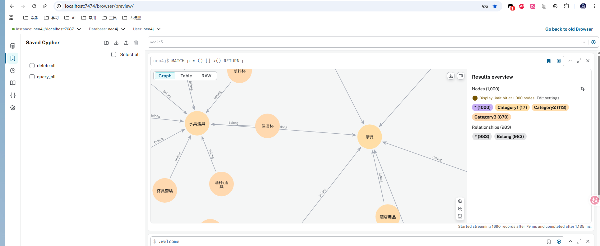
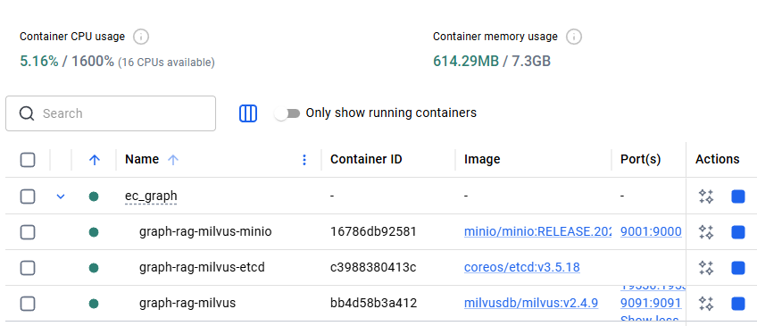
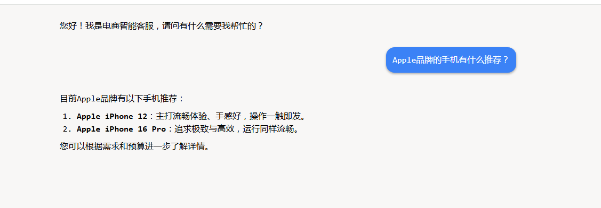

# GraphRAG Commerce · 电商知识增强问答系统

<p align="center">
  <b>基于 Neo4j + Hybrid Retrieval + GraphRAG 的电商商品知识增强问答系统</b>
</p>

<p align="center">
  
  
  
  
  
  
  
</p>

---

## 项目概述

针对电商场景中**商品属性长尾**、**关键词检索召回不足**以及**大模型幻觉**问题，设计并实现基于 Hybrid Retrieval 与 GraphRAG 的知识增强问答系统。通过结构化图谱检索与向量召回融合，提高商品属性问答准确率与知识覆盖能力。

当前项目包含完整的图谱构建、NER 标签抽取、Hybrid Retrieval 实体对齐、GraphRAG 问答服务和可运行 Demo：

- 基于 Neo4j 构建商品知识图谱，完成 SKU/SPU、品牌、品类、属性及标签的实体关系建模。
- 基于 Debezium + Kafka 搭建 MySQL → Neo4j 实时同步链路，支持批量全量和 CDC 增量写入。
- 基于 BGE Embedding + BM25 构建 Hybrid Retrieval 混合检索框架，采用 RRF 融合稀疏召回与向量召回结果。
- 基于 BERT 训练中文商品标签 NER 模型，从商品描述中抽取卖点、规格和场景标签。
- 基于 LangChain + DeepSeek 实现 LLM 参数化 Cypher 生成、只读安全校验和图谱问答。
- 构建电商长尾商品 QA 测试集，相比 BM25 单路检索，Recall@5 提升 **17.6%**，Precision@5 提升 **10.8%**。

## 核心能力

- **商品知识图谱** — SKU、SPU、品牌、三级品类、平台属性、销售属性和商品标签全覆盖。
- **数据同步链路** — MySQL 批量全量写入 + Debezium + Kafka CDC 增量消费，映射文件配置驱动。
- **Hybrid Retrieval** — BGE 向量召回 + Neo4j full-text 全文检索 + Milvus 向量索引 + RRF 融合 + BGE-Reranker 精排。
- **NER / UIE 标签抽取** — 基于 Label Studio 标注数据，使用 ERNIE 3.0 进行信息抽取模型微调，实现商品名、品牌、品类、属性名等关键槽位识别。
- **GraphRAG 问答** — LLM 生成参数化 Cypher → 只读安全校验 → 图谱查询 + 子图多跳扩展 → LLM 生成可追溯回答。
- **查询安全控制** — 执行前校验 LLM 生成语句，禁止写入、多语句和未声明参数。

## 系统架构



## 知识图谱可视化





## 运行效果

**示例问答流程**

```
用户: Apple品牌的手机有什么推荐？
  │
  ├─ 1. LLM 解析问题 → 生成参数化 Cypher
  │      MATCH (t:Trademark {name: $param_0})-[:Belong]-(spu:SPU)
  │      RETURN spu.name, spu.description LIMIT 5
  │
  ├─ 2. 实体对齐 (Hybrid Retrieval)
  │      "Apple" → BGE 向量召回 + 全文检索 → "Apple" (Trademark)
  │
  ├─ 3. 只读安全校验 ✅
  │      MATCH 开头 · 单条语句 · 含 RETURN · 无写入关键字
  │
  ├─ 4. 图谱查询 → 返回 Apple 品牌下 SPU 列表
  │
  └─ 5. LLM 基于查询结果生成回答
         "为您推荐苹果品牌的两款手机——Apple iPhone 12 和
          Apple iPhone 16 Pro。其中 iPhone 16 Pro 为最新旗舰
          机型，性能更强；iPhone 12 则是性价比较高的选择。"
```



## 技术栈

| 类别 | 组件 |
| --- | --- |
| 图数据库 | Neo4j 5.x |
| 向量数据库 | Milvus 2.4+ |
| 大模型 | DeepSeek (via LangChain) |
| Embedding | BAAI/bge-large-zh-v1.5 |
| NER 模型 | google-bert/bert-base-chinese |
| Web 框架 | FastAPI |
| 消息队列 | Kafka + Debezium Connect |
| 依赖管理 | uv (pyproject.toml) |
| 容器化 | Docker Compose |

## 项目结构

```text
graph_rag/
├── data/
│   ├── demo/catalog.json          # 示例商品图谱数据
│   ├── ner/                       # NER 训练与标注数据
│   │   ├── description.txt        #   商品描述原始文本
│   │   └── raw/data.json          #   Label Studio BIO 标注数据
│   ├── questions.json             # 问答测试用例
│   └── gmall.sql                  # MySQL 业务库建表与数据
├── docs/
│   └── ne4j_dispalay.png          # Neo4j 图谱可视化截图
├── scripts/
│   ├── create_indexes.py          # Neo4j 约束与全文索引
│   ├── seed_graph.py              # 示例图谱一键写入
│   ├── sync_milvus_entities.py    # Neo4j 实体同步到 Milvus
│   ├── register_debezium_connector.py
│   └── neo4j_client.py            # Neo4j driver 上下文管理器
├── src/
│   ├── configuration/             # 全局配置与映射文件
│   │   ├── config.py
│   │   ├── cdc_table_mapping.json
│   │   └── uie_product_tag.yaml
│   ├── datasync/                  # MySQL → Neo4j 数据同步
│   │   ├── table_sync.py          #   批量全量同步
│   │   ├── cdc_consumer.py        #   CDC 增量消费
│   │   ├── text_sync.py           #   NER 标签抽取写入
│   │   └── utils.py               #   MySQLReader / Neo4jWriter
│   ├── evaluation/                # 检索评估
│   │   └── retrieval_eval.py
│   ├── ner/                       # NER & UIE 信息抽取
│   │   ├── preprocess.py
│   │   ├── train.py
│   │   ├── eval.py
│   │   ├── predict.py
│   │   ├── uie_preprocess.py       #   UIE 数据转换
│   │   ├── uie_train.py            #   ERNIE 3.0 微调
│   │   └── uie_predict.py          #   UIE 结构化抽取
│   ├── retrieval/                 # Milvus 实体索引与检索
│   │   ├── hybrid_retriever.py     #   RRF 融合 + Reranker
│   │   ├── milvus_entity_store.py
│   │   ├── search_factory.py       #   多路召回工厂
│   │   └── subgraph_expander.py    #   多跳子图扩展
│   └── web/                       # FastAPI 服务
│       ├── app.py
│       ├── service.py             #   GraphRAG 问答核心
│       ├── cypher_guard.py        #   Cypher 只读安全校验
│       ├── cypher_templates.py    #   预定义 Cypher 模板
│       ├── schemas.py
│       ├── utils.py               #   索引管理工具
│       └── static/index.html      #   聊天前端页面
├── tests/
├── docker-compose.yml             # Neo4j
├── docker-compose.cdc.yml         # MySQL + Kafka + Debezium
├── docker-compose.milvus.yml      # Milvus standalone
├── pyproject.toml
├── .env.example
├── main.py
└── LICENSE
```

## 环境要求

| 组件 | 说明 |
| --- | --- |
| Python | 3.12+ |
| uv | Python 包管理器 |
| Docker + Compose | 运行 Neo4j / Milvus / CDC 基础设施 |
| MySQL | 5.7+（数据同步时需要） |
| DeepSeek API Key | 启动问答服务时需要 |

## 快速开始

> 两种使用方式：
> - **快速体验**：使用内置 `data/demo/catalog.json` 示例图谱，无需 MySQL
> - **真实数据**：使用 `data/gmall.sql` 导入 MySQL，走完整数据同步链路

### 1. 安装依赖

```bash
git clone https://github.com/XiaoFeiCode/graph_rag.git
cd graph_rag
uv sync --locked
```

### 2. 配置环境变量

```bash
cp .env.example .env
```

确保 Neo4j 连接配置正确：

```text
NEO4J_URI=neo4j://localhost
NEO4J_USER=neo4j
NEO4J_PASSWORD=graph_rag_demo
```

### 3. 启动 Neo4j

```bash
docker compose up -d
```

Neo4j Browser：http://localhost:7474（默认 `neo4j` / `graph_rag_demo`）

### 4. 初始化图谱

**方式一：示例图谱（快速体验）**

```bash
uv run python -m scripts.seed_graph
```

**方式二：真实业务数据**

```bash
# 导入 MySQL 业务数据
mysql -u root -p gmall < data/gmall.sql

# 全量同步到 Neo4j
uv run python -m src.datasync.table_sync
```

### 5. 启动问答服务

```bash
uv sync --extra rag
uv run uvicorn src.web.app:app --host 0.0.0.0 --port 8000
```

打开浏览器访问 **http://localhost:8000** 使用聊天界面。

## API 接口

### `POST /api/chat`

电商商品问答接口。

**请求体**

```json
{
  "message": "有没有适合拍照的 Apple 手机？"
}
```

**响应体**

```json
{
  "message": "根据商品知识图谱，iPhone 15 属于 Apple 品牌，卖点包括 4800 万像素主摄、A16 芯片和轻薄机身。"
}
```

**内部流程**

1. LLM 解析用户问题，生成参数化 Cypher 查询语句
2. Hybrid Retrieval 对齐实体（品牌/品类/SPU/SKU）
3. 只读安全校验（禁止写入/多语句/未声明参数）
4. 执行图谱查询
5. LLM 基于结构化结果生成回答

## 配置说明

核心环境变量（`.env`）：

| 变量 | 用途 | 默认值 |
| --- | --- | --- |
| `DEEPSEEK_API_KEY` | DeepSeek API Key | （必填） |
| `DEEPSEEK_BASE_URL` | API 地址 | `https://api.deepseek.com` |
| `NEO4J_URI` | Neo4j Bolt 连接 | `neo4j://localhost` |
| `NEO4J_USER` | Neo4j 用户名 | `neo4j` |
| `NEO4J_PASSWORD` | Neo4j 密码 | `graph_rag_demo` |
| `MYSQL_HOST` | MySQL 地址 | `localhost` |
| `MYSQL_DB` | 数据库名称 | `gmall` |
| `MODEL_NAME` | NER 预训练模型 | `google-bert/bert-base-chinese` |
| `CDC_KAFKA_BOOTSTRAP_SERVERS` | Kafka 地址 | `localhost:9092` |
| `MILVUS_URI` | Milvus 地址 | `http://localhost:19530` |

完整配置项见 `.env.example`。

## 数据同步

### 批量全量同步

```bash
uv run python -m src.datasync.table_sync
```

同步范围：三级品类、品牌、SPU/SKU、平台属性、销售属性及相互关系。

### NER 标签抽取

```bash
uv sync --extra ml
uv run python -m src.ner.preprocess    # 预处理标注数据
uv run python -m src.ner.train         # 训练
uv run python -m src.ner.eval          # 评估
uv run python -m src.datasync.text_sync   # 抽取标签写入 Neo4j
```

### CDC 增量同步

```bash
docker compose -f docker-compose.cdc.yml up -d
uv sync --extra cdc
uv run python -m scripts.register_debezium_connector
uv run python -m src.datasync.cdc_consumer
```

表到图谱映射维护在 `src/configuration/cdc_table_mapping.json`。

## 检索评估

```bash
uv run python -m src.evaluation.retrieval_eval --top-k 5
```

报告输出至 `reports/retrieval_eval.json` 和 `reports/retrieval_eval.md`。

评估指标：

| 指标 | 说明 |
| --- | --- |
| Recall@5 | 期望实体在前 5 条结果中被命中的比例 |
| Precision@5 | 前 5 条结果中命中期望实体的比例 |
| MRR | 第一个命中实体的排名倒数均值 |

## NER 训练配置

| 配置项 | 当前值 |
| --- | --- |
| Backbone | `google-bert/bert-base-chinese` |
| 任务 | 商品文本 BIO 序列标注（B / I / O） |
| Epochs | 5 |
| Batch Size | 2 |
| Learning Rate | 7e-6 |
| Mixed Precision | fp16 |

训练数据位于 `data/ner/`：

| 文件 | 说明 |
| --- | --- |
| `data/ner/description.txt` | 商品描述原始文本（85KB） |
| `data/ner/raw/data.json` | Label Studio BIO 标注数据（732KB） |

## 查询安全

LLM 生成的 Cypher 在执行前经过多层校验：

- ✅ 只允许单条查询语句
- ✅ 必须以 `MATCH`、`OPTIONAL MATCH`、`WITH`、`UNWIND` 开头
- ✅ 必须包含 `RETURN`
- ✅ 禁止 `CREATE`、`MERGE`、`SET`、`DELETE` 等写入操作
- ✅ 参数必须由实体对齐阶段声明

## 路线图

- [ ] Full-text vs Vector vs Hybrid Retrieval 三路对比评估
- [ ] Milvus + BGE-Reranker 接入 GraphRAG 实体对齐主链路
- [ ] Cypher 生成模板与错误重试策略
- [ ] CDC 表映射扩展：价格、库存和销售属性变更
- [ ] 集成测试与 CI

## License

MIT License · [XiaoFeiCode](https://github.com/XiaoFeiCode)
