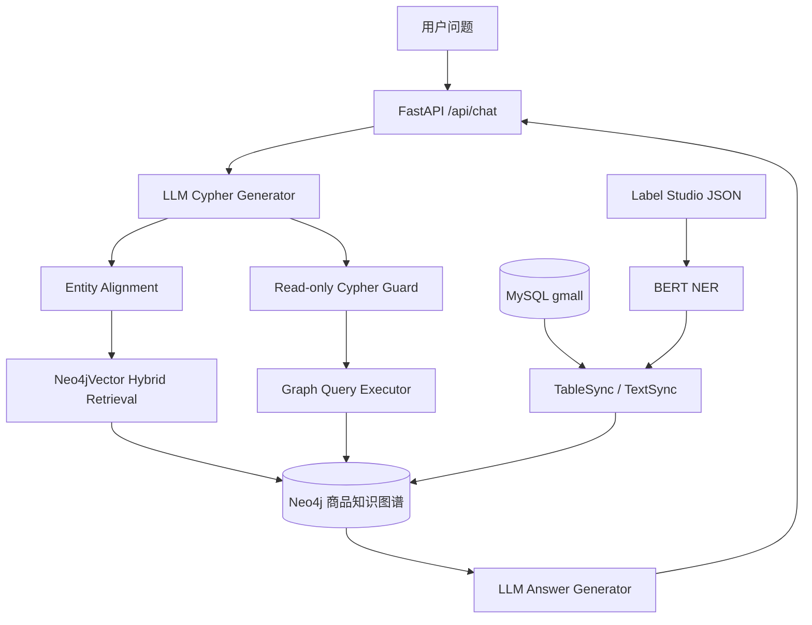

# GraphRAG Commerce：电商知识图谱增强问答系统


面向电商商品咨询场景的知识增强问答系统。项目基于 **Neo4j 商品知识图谱 + Hybrid Retrieval 实体对齐 + LLM Cypher 生成 + FastAPI Web 服务** 构建，解决商品属性长尾、品牌/品类别名、关键词召回不足以及大模型幻觉等问题。

## 项目概述

电商商品问答中，用户问题通常包含品牌、品类、型号、规格、卖点和长尾属性。仅依赖关键词搜索容易召回不全，仅依赖大模型生成又容易产生无法追溯的答案。本项目将商品、品牌、SKU/SPU、品类、属性和标签建模为知识图谱，通过图查询保证结构化关系的准确性，通过向量检索和全文检索提升实体对齐能力。

当前项目包含完整的图谱构建、NER 标签抽取、Hybrid Retrieval、GraphRAG 问答服务和最小可运行 Demo：

- 基于 MySQL 业务表的商品知识图谱同步流程。
- 基于 BERT token classification 的中文商品标签抽取模型。
- 基于 BGE Embedding、Neo4j 向量索引和全文索引的 Hybrid Retrieval 实体对齐。
- 基于 LangChain + DeepSeek 的参数化 Cypher 生成和答案生成。
- 基于 FastAPI 的 `/api/chat` 问答接口和静态聊天页面。
- 基于 Docker Compose 的 Neo4j 本地 Demo 图谱。

## 核心能力

- **商品图谱建模**：覆盖 `SKU`、`SPU`、品牌、三级品类、平台属性、销售属性和商品标签。
- **数据同步链路**：将 MySQL 中的商品、类目、品牌和属性数据批量写入 Neo4j。
- **长尾标签抽取**：使用中文 BERT NER 模型从商品描述中抽取卖点、规格和场景标签。
- **Hybrid Retrieval**：结合 BGE 向量召回和 Neo4j full-text index，对齐用户问题中的商品、品牌和品类实体。
- **GraphRAG 问答**：由 LLM 生成参数化 Cypher，执行图谱查询后再基于结构化结果生成回答。
- **查询安全控制**：执行前校验 LLM 生成的 Cypher，只允许单条只读查询，阻断写入和过程调用。
- **可复现 Demo**：内置样例商品图谱，可通过 `docker compose` 和 seed 脚本快速跑通。
- **检索评估**：基于示例问题计算 Recall@K、Precision@K 和 MRR，输出 JSON 与 Markdown 报告。

## 系统架构



## 项目结构

```text
graph_rag/
├── data/
│   ├── demo/catalog.json       # 最小 Demo 商品图谱数据
│   └── ner/raw/data.json       # 商品 NER 标注样例
├── docs/
│   └── architecture.md         # 架构与链路说明
├── examples/
│   └── questions.json          # Demo 问题与预期实体
├── scripts/
│   ├── create_indexes.py       # Neo4j 约束和全文索引
│   ├── seed_graph.py           # 写入 Demo 图谱
│   └── smoke_query.py          # 图谱查询 smoke test
├── src/
│   ├── configuration/          # 路径、模型、数据库和超参数配置
│   ├── datasync/               # MySQL -> Neo4j 数据同步
│   ├── evaluation/             # 检索评估脚本
│   ├── ner/                    # NER 数据处理、训练、评估和预测
│   └── web/                    # FastAPI、GraphRAG 服务和前端页面
├── docker-compose.yml          # Neo4j 本地服务
├── pyproject.toml              # Python 依赖配置
└── uv.lock                     # 可复现依赖锁文件
```

## 环境要求

基础 Demo：

```text
Python 3.12+
uv
Docker
Docker Compose
```

完整 GraphRAG 服务：

```text
DeepSeek API Key
Neo4j 5.x
BGE embedding model runtime
```

NER 训练：

```text
PyTorch
Transformers
HuggingFace Datasets
GPU 可选
```

## 快速开始

### 1. 安装基础依赖

```powershell
uv sync --locked
```

### 2. 创建配置文件

```powershell
Copy-Item .env.example .env
```

基础 Demo 默认使用：

```text
NEO4J_URI=neo4j://localhost
NEO4J_USER=neo4j
NEO4J_PASSWORD=graph_rag_demo
```

### 3. 启动 Neo4j

```powershell
docker compose up -d
```

Neo4j Browser：

```text
http://localhost:7474
```

默认账号密码：

```text
neo4j / graph_rag_demo
```

### 4. 初始化 Demo 图谱

```powershell
uv run python -m scripts.seed_graph
```

### 5. 执行 Smoke Test

```powershell
uv run python -m scripts.smoke_query
```

输出会返回样例商品、品牌、标签和 SKU，例如 `iPhone 15`、`HUAWEI Mate 60` 和 `美的 5L 空气炸锅`。

## 启动问答服务

问答服务需要安装 RAG 相关依赖，并在 `.env` 中配置 DeepSeek API。

```powershell
uv sync --extra rag
```

启动服务：

```powershell
uv run uvicorn src.web.app:app --host 0.0.0.0 --port 8000
```

访问页面：

```text
http://localhost:8000
```

## 配置说明

| 变量 | 用途 | 是否必填 |
| --- | --- | --- |
| `DEEPSEEK_API_KEY` | DeepSeek API Key | 启动问答服务时必填 |
| `DEEPSEEK_BASE_URL` | DeepSeek OpenAI-compatible API 地址 | 启动问答服务时必填 |
| `MYSQL_HOST` / `MYSQL_PORT` | MySQL 地址和端口 | 同步业务库时必填 |
| `MYSQL_USER` / `MYSQL_PASSWORD` | MySQL 账号密码 | 同步业务库时必填 |
| `MYSQL_DB` | 商品业务库名称 | 同步业务库时必填 |
| `NEO4J_URI` | Neo4j Bolt 地址 | 是 |
| `NEO4J_USER` / `NEO4J_PASSWORD` | Neo4j 账号密码 | 是 |
| `MODEL_NAME` | NER 预训练模型名称 | 训练 NER 时使用 |
| `HF_ENDPOINT` | Hugging Face 镜像地址 | 可选 |

不要提交真实的 `.env` 文件。

## 数据同步

从 MySQL 同步商品、品牌、品类和属性数据到 Neo4j：

```powershell
uv run python -m src.datasync.table_sync
```

使用 NER 模型抽取商品描述标签，并写入 `Tag` 节点：

```powershell
uv run python -m src.datasync.text_sync
```

如果只需要初始化 Demo 图谱，可直接运行：

```powershell
uv run python -m scripts.seed_graph
```

## NER 训练与评估

安装 ML 依赖：

```powershell
uv sync --extra ml
```

预处理 Label Studio 标注数据：

```powershell
uv run python -m src.ner.preprocess
```

训练模型：

```powershell
uv run python -m src.ner.train
```

评估模型：

```powershell
uv run python -m src.ner.eval
```

命令行预测：

```powershell
uv run python -m src.ner.predict
```

## API 示例

接口地址：

```text
POST /api/chat
```

请求体：

```json
{
  "message": "有没有适合拍照的 Apple 手机？"
}
```

响应体：

```json
{
  "message": "根据商品知识图谱，iPhone 15 属于 Apple 品牌，卖点包括 4800 万像素主摄、A16 芯片和轻薄机身。"
}
```

## 查询安全

LLM 生成的 Cypher 在执行前会经过只读校验：

- 只允许单条查询语句。
- 查询必须从 `MATCH`、`OPTIONAL MATCH`、`WITH` 或 `UNWIND` 等读子句开始。
- 禁止 `CREATE`、`MERGE`、`SET`、`DELETE`、`REMOVE`、`DROP`、`LOAD`、`CALL` 等写入或过程调用关键字。
- 查询必须包含 `RETURN`。
- 查询中引用的 `$param_0`、`$param_1` 等参数必须由实体对齐阶段声明。

## 示例问题

`examples/questions.json` 提供了最小 Demo 的测试问题：

```text
有没有适合拍照的 Apple 手机？
华为 Mate 系列有什么卖点？
推荐一个适合少油烹饪的厨房电器
iPhone 15 有哪些 SKU？
```

## 检索评估

先初始化 Demo 图谱：

```powershell
docker compose up -d
uv run python -m scripts.seed_graph
```

运行 Neo4j full-text baseline 评估：

```powershell
uv run python -m src.evaluation.retrieval_eval --top-k 5
```

输出文件：

```text
reports/retrieval_eval.json
reports/retrieval_eval.md
```

当前指标用于验证评估链路和样例召回效果。后续接入向量检索、Hybrid Retrieval 或 Milvus 后，可以复用同一批 `examples/questions.json` 做对比。

## 开发验证

```powershell
python -m unittest tests.test_cypher_guard
python -m compileall -q src scripts tests main.py
docker compose config
uv run python -m scripts.seed_graph
uv run python -m scripts.smoke_query
uv run python -m src.evaluation.retrieval_eval --top-k 5
```

## 当前边界

- Demo 图谱为小样例数据，用于验证图谱建模、索引和查询链路。
- 完整问答服务依赖 DeepSeek API、BGE embedding 模型和 Neo4j 向量索引。
- `checkpoints/` 下的模型权重体积较大，默认不提交到 Git。
- 当前 MySQL -> Neo4j 为批量同步流程，实时增量同步可以继续扩展 Debezium + Kafka。
- 当前检索评估基于小样例图谱，后续可扩展为更大规模商品 QA 测试集。

## Roadmap

- 扩展 Retrieval Evaluation：对比全文检索、向量检索和 Hybrid Retrieval。
- 将向量索引扩展到 Milvus，Neo4j 保留结构化关系推理。
- 增加 Cypher 生成模板和错误重试策略。
- 增加 Docker Compose 中的 MySQL 服务和初始化样例数据。
- 增加 GraphRAG API 的集成测试和 CI smoke test。
